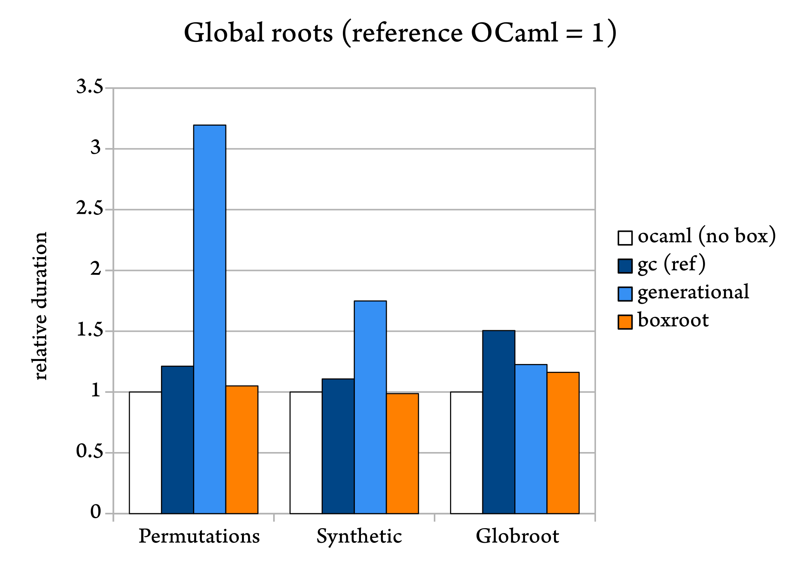
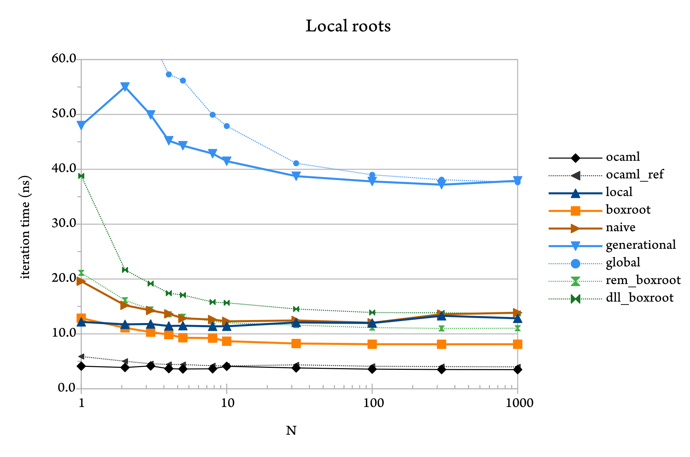

# Boxroot: fast movable roots for the OCaml C interface

This repository hosts an experiment with a different root-registration
API for the OCaml garbage collector. The new kind of roots are called
`boxroot` (boxed roots).

The traditional root-registration APIs let users decide which existing
parts of memory should be considered as new roots by the runtime. With
boxroots, it is our allocator, not the user, that decides where these
roots are placed in memory. This extra flexibility allows for a more
efficient implementation.

We provide an implementation of this idea as a standalone C library
([boxroot/](boxroot/) in this repository), as a custom allocator using
OCaml's GC scanning hooks. Our prototype already shows promising
performance in benchmarks.

In addition to better performance, movable roots fit a common use-case
where Ocaml values are placed inside malloc'ed blocks and then
registered as global roots, for instance for insertion in C library
data structures. This pattern appears to be common. Our original
motivation for prototyping boxroots generalises that: it is to propose
an idiomatic manipulation of OCaml roots from Rust, similar to
`Box<T>` pointers.

## Design

Functions to acquire, read, release and modify a `boxroot` are
provided as follows.

```c
boxroot boxroot_create(value);
value boxroot_get(boxroot);
value const * boxroot_get_ref(boxroot);
void boxroot_delete(boxroot);
void boxroot_modify(boxroot *, value);
```

These functions operate in constant time. (This can be compared to the
probabilistic logarithmic time offered by global roots.)

See [boxroot/boxroot.h](boxroot/boxroot.h) for API documentation.

## Benchmarks

To evaluate our experiment, we run various allocation-heavy
benchmarks.

### Implementations

The benchmarks compares various implementation of a cell containing a
single value with the same interface as boxroot (`create`, `get`,
`delete`, `modify`):

- `ocaml`: a pure OCaml implementation where `create` is the identity
  and nothing happens on deletion.
- `ocaml_ref`: a pure OCaml implementation using a mutable record, with
  deletion implemented by assigning `()` using Obj.magic.
- `gc`: a C implementation of the previous, using
  `caml_alloc_small(1,0)`,
- `boxroot`: a `boxroot` disguised as an immediate (reference
  implementation described further below),
- `naive`: like `boxroot`, but without taking advantage of the full
  expressiveness of boxroot (for the local roots benchmark below)
- `global`: a block allocated outside the OCaml heap (disguised as an
  immediate) containing a global root, and
- `generational`: idem, but using a generational
  global root.
- `dll_boxroot`: a variant of `boxroot`, but using a simpler
  implementation with doubly-linked lists,
- `rem_boxroot`: a variant of `boxroot`, but using a different
  implementation using OCaml's remembered set.

The various implementations (except the first one) have similar memory
representation, some on the OCaml heap and some outside of the OCaml
heap.

By selecting different implementations of Ref, we can evaluate the
overhead of root registration and scanning for various root
implementations, compared to non-rooting OCaml and C implementations,
along with other factors.

### Benchmark information

The figures below are obtained with OCaml 4.12, with CPU AMD Ryzen
5850U.

### Permutations of a list

The small program used in this benchmark computes the set of all
permutations of the list [0; ..; n-1], using a non-determinism monad
represented using (strict) lists. (This is an exponential way to
compute factorial(n) with lots of allocations.)

In our non-determinism monad, each list element goes through the Ref
module that boxes its underlying value, and may be implemented
(through C stubs) as an abstract block (not followed by the GC) whose
value is registered as a GC root.

This benchmark creates a lot of roots alive at the same time.

```
$ make run-perm_count TEST_MORE=2
Benchmark: perm_count
---
boxroot: 1.88s
gc: 2.17s
ocaml: 1.79s
generational: 5.72s
ocaml_ref: 2.16s
dll_boxroot: 2.15s
rem_boxroot: 2.06s
global: 47.29s
```

We see that global roots add a large overhead, which is reduced by
using generational global roots. Boxroots outperform generational
global roots, and are competitive with the reference implementations
that do not use roots (ocaml and gc).


### Synthetic benchmark

In this benchmark, we allocate and deallocate values and roots
according to probabilities determined by parameters.

* `N=8`: log_2 of the number of minor generations
* `SMALL_ROOTS=10_000`: the number of small roots allocated (in the
  minor heap) per minor collection,
* `LARGE_ROOTS=20`: the number of large roots allocated (in the major
  heap) per minor collection,
* `SMALL_ROOT_PROMOTION_RATE=0.2`: the survival rate for small roots
  allocated in the current minor heap,
* `LARGE_ROOT_PROMOTION_RATE=1`: the survival rate for large roots
  allocated in the current minor heap,
* `ROOT_SURVIVAL_RATE=0.99`: the survival rate for roots that survived
  a first minor collection,
* `GC_PROMOTION_RATE=0.1`: promotion rate of GC-tracked values,
* `GC_SURVIVAL_RATE=0.5`: survival rate of GC-tracked values.

These settings favour the creation of a lot of roots, most of which
are short-lived. Roots that survive are few, but they are very
long-lived.

```
$ make run-synthetic TEST_MORE=2
Benchmark: synthetic
---
boxroot: 5.89s
gc: 6.61s
ocaml: 5.97s
generational: 10.44s
ocaml_ref: 6.74s
dll_boxroot: 6.42s
rem_boxroot: 6.01s
global: 15.20s
```

Since the boxroot is directly inside a gc-allocated value, our
benchmarks leave few opportunities for the version using boxroots
outperforming the versions without roots, so the repeatable
outperformance of non-roots versions by the boxroot version in this
benchmark is surprising. It could be explained by the greater cache
locality of pools during scanning.


### Globroot benchmark

This benchmark is adapted from the OCaml testsuite. It exercises the
case where there are about 1024 concurrently-live roots, but only a
couple of young roots are created between two minor collections.

This benchmark tests the case where there are few
concurrently-live roots and little root creation and
modification between two collections. This corresponds to
a common scenario where the FFI is rarely used, except that
this benchmark does not perform any OCaml computations or
allocations (it forces collections to occur very often despite
low GC work), so the cost of root handling is magnified, it
would normally be amortized by OCaml computations.

```
$ make run-globroots TEST_MORE=2
Benchmark: globroots
---
boxroot: 1.09s
gc: 1.38s
ocaml: 1.08s
generational: 1.14s
ocaml_ref: 1.46s
dll_boxroot: 1.09s
rem_boxroot: 1.12s
global: 1.40s
```

In this benchmark, there are about 67000 minor collections and 40000
major collections. List-based and remembered-set-based implementations
are expected to perform well, whereas `boxroot` has to scan on the
order of a full memory pool at every minor collection even if there
are only a few young roots, for a pool size currently chosen large
(16KB). This overhead would have been noticeable in this benchmark,
but it has been reduced thanks to an optimisation brought to scanning
during minor collection.



### Local roots benchmark

We designed this benchmark to test the idea of replacing local
roots altogether by boxroots.

Currently, OCaml FFI code uses a "callee-roots" discipline
where each function has to locally "root" each OCaml value
received as argument or used as a temporary paramter, using
the efficient `CAMLparam`, `CAMLlocal`, `CAMLreturn` macros.

Boxroots suggest a "caller-root" approach where callers would
package their OCaml values in boxroots, whose ownership is
passed to the callee. Creating boxroots is slower than
registering local roots, but the caller-root discipline can
avoid re-rooting each value when moving up and down the call
chain, so it is expected to have a performance advantage for
deep call chains.

This benchmark performs a (recursive) fixpoint computation on
OCaml floating-point value from C, with a parameter N that
decides the number of fixpoint iterations necessary, and thus
the length of the C-side call chain.

The local-roots version is as follows:

```c
int compare_val(value x, value y);

value local_fixpoint(value f, value x)
{
  CAMLparam2(f, x);
  CAMLlocal1(y);
  y = caml_callback(f,x);
  if (compare_val(x, y)) {
    CAMLreturn(y);
  } else {
    CAMLreturn(local_fixpoint(f, y));
  }
}
```
where `compare_val` compares the values of `x` and `y`, but introduces
local roots in order to simulate a more complex operation.

The boxroot version is as follows:

```c
value boxroot_fixpoint(value f, value x)
{
  boxroot y = boxroot_fixpoint_rooted(BOX(f), BOX(x));
  value v = GET(y);
  DROP(y);
  return v;
}

#define BOX(v) boxroot_create(v)
#define GET(b) boxroot_get(b)
#define DROP(b) boxroot_delete(b)

int compare_refs(value const *x, value const *y);

boxroot boxroot_fixpoint_rooted(boxroot f, boxroot x)
{
  boxroot y = BOX(caml_callback(GET(f), GET(x)));
  if (compare_refs(GET_REF(x), GET_REF(y))) {
    DROP(f);
    DROP(x);
    return y;
  } else {
    DROP(x);
    return boxroot_fixpoint_rooted(f, y);
  }
}
```
where `compare_refs` does the same work as `compare_val` but does not
need to root its values.

The work is done by `boxroot_fixpoint_rooted`, but we need a
`boxroot_fixpoint` wrapper to go from the callee-roots convention
expected by OCaml `external` declarations to a caller-root convention.
(This wrapper also adds some overhead for small call depths.)

The `naive` test uses boxroots in a callee-roots discipline.

```
Benchmark: local_roots
```



We see that, in this test, despite the up-front cost of wrapping the
function, `boxroot`s are equivalent to or outperform OCaml's local
roots. More precisely, `boxroots` are slightly more expensive than
local roots when following the same callee-roots discipline, and the
caller-roots discipline offers huge saves in this benchmark. The saves
from the caller-roots discipline come from:
- introducing fewer roots,
- enabling recursion to be done via a tail call,
- enabling better code generation after inlining.

As this is dependent on programming style, the relative performance
will vary depending on the test program. Our conclusions:
- Using boxroots is roughly competitive with local roots.
- It can be beneficial if one leverages the added flexibility of
  boxroots.
- It could be much more beneficial in specific scenarios, for instance
  when traversing large OCaml structures from a foreign language, with
  many function calls.

Furthermore, we envision that with support from the OCaml compiler for
the caller-roots discipline, the wrapping responsible for initial
overhead could be made unnecessary.

## Implementation

We implemented a custom allocator that manages fairly standard
freelist-based memory pools, but we make arrangements such that we can
scan these pools efficiently. In standard fashion, the pools are
aligned in such a way that the most significant bits can be used to
identify the pool from the address of their members. Since elements of
the freelist are guaranteed to point only inside the memory pool, and
non-immediate OCaml values are guaranteed to point only outside of the
memory pool, we can identify allocated slots as follows:

```
allocated(slot, pool) ≝ (pool != (slot & ~(1<<N - 2)))
```

N is a parameter determining the size of the pools. The bitmask is
chosen to preserve the least significant bit, so that immediate OCaml
values (with lsb set) are correctly classified.

Scanning is set up by registering a root-scanning hook with the OCaml
GC, and done by traversing the pools linearly. An early-exit
optimisation when all roots have been found ensures that programs that
use few roots throughout the life of the program only pay for what
they use.

The memory pools are managed in several rings, according to their
*class*. The class distinguishes pools according to OCaml generations,
as well as pools that are free (which need not be scanned). A pool is
*young* if it is allowed to contain pointers to the minor heap. During
minor collection, we only need to scan young pools. At the end of the
minor collection, the young pools, now guaranteed to no longer point
to any young value, are promoted into *old* pools. We unconditionally
allocate roots in young pools, to avoids testing at allocation-time
whether their initial value is young or old.

The rings are managed in such a manner that pools that are less than
half-full are rotated to the start of the ring. This ensures that it
is easy to find a pool for allocation. When the current pool is full,
if no young pool is available then we demote the first old pool into
a young pool, if it is less than half-full. (This pool contains major
roots, but it is harmless to scan them during minor collection.)
Otherwise we prefer to allocate a new pool.

Care is taken so that programs that do not allocate any root do not
pay any of the cost.

## Limitations

* Our prototype library uses `posix_memalign`, which currently limits
  its portability on some systems.

* No synchronisation is performed yet in the above benchmarks. In the
  released version, synchronisation is currently implemented with a
  global lock not representative of expected performance. We intend to
  lift this limitation in the future.

* Due to limitations of the GC hook interface, no work has been done
  to scan roots incrementally. Holding a (very!) large number of roots
  at the same time can negatively affect latency at the beginning of
  major GC cycles.
